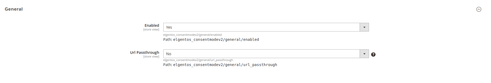
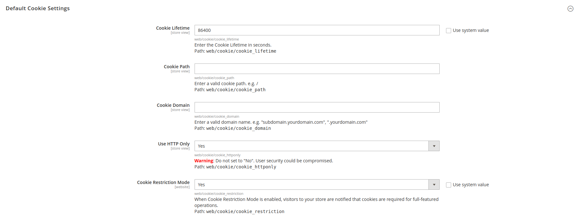

# elgentos/magento2-consentmode-v2

This extension is based on the Hyva default cookie bar. All features that are in that extension are in this one. 

- [Main Functionalities](#markdown-header-main-functionalities)
- [Installation](#markdown-header-installation)
- [Configuration](#markdown-header-configuration)

## Main Functionalities

This extension:
- Overrides the default Hyva cookie bar
- Sets default consentMode

``
  gtag('consent', 'default', {
  'ad_storage': 'denied',
  'ad_user_data': 'denied',
  'ad_personalization': 'denied',
  'functionality_storage': 'denied',
  'personalization_storage': 'denied',
  'security_storage': 'denied',
  });
``

- This fires the GTM build in trigger like this:


- shows banner when consentMode is not set in localstorage or isUserAllowedSaveCookieName (default magento cookie) is null


- You can click 3 buttons
  - Deny: routes you to the noCookies url you can set in the backend
  - Customize: set the cookies you selected above
  - Allow All: All cookies are allowed (all checkmarks are set)

Logic behind this:
```
{
    'functionality_storage': consent.necessary ? 'granted' : 'denied',
    'security_storage': consent.necessary ? 'granted' : 'denied',
    'personalization_storage': consent.preferences ? 'granted' : 'denied',
    'analytics_storage': consent.statistics ? 'granted' : 'denied',
    'ad_storage': consent.marketing ? 'granted' : 'denied',
    'ad_user_data': consent.marketing ? 'granted' : 'denied',
    'ad_personalization': consent.marketing ? 'granted' : 'denied',
};
```

- When gtag consent default is set, an event is fired in GTM called: `default` When the settings are changed, the `update` event is fired.

As you can see in this example:


- It adds a button on the absolute bottom of the page so you can always open the cookie settings (this is intentionally not fixed on the viewport)

Would be nice to have multiple events on multiple levels of consent you can add in GTM.

## Installation

1. Install the package into your repository using composer.
```
composer require elgentos/magento2-consentmode-v2
```

2. Enable the Magento module.
```
bin/magento module:enable Elgentos_ConsentModeV2
```

## Configuration

1. Enable the module in the Magento backend.
   - Navigate to "Stores → Configuration → Extensions → Elgentos → Consent Mode V2".
   - Set the option "Enabled" to yes.
   


2. Turn on "Cookie Restriction Mode".
   - Navigate to "Stores → Configuration → General → Web → Default Cookie Settings → Cookie Restriction Mode"
   - Uncheck "Use system value" and set the option "Cookie Restriction Mode" to "Yes".


