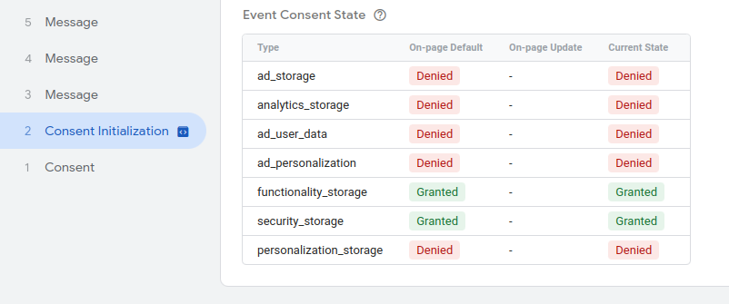
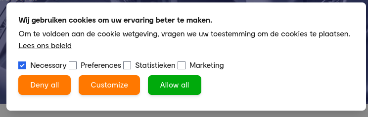
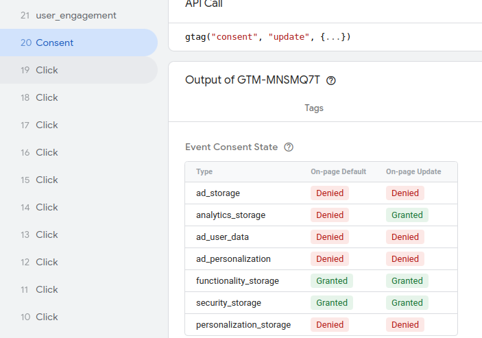

# magento2-consentmode-v2

This extension is based on the Hyva default cookie bar. All features that are in that extension are in this one. 

This extension:
- removes the default Hyva cookie bar
- sets default consentMode

``
  gtag('consent', 'default', {
  'ad_storage': 'denied',
  'ad_user_data': 'denied',
  'ad_personalization': 'denied',
  'functionality_storage': 'denied',
  'personalization_storage': 'denied',
  'security_storage': 'denied',
  });
``

- This fires the GTM build in trigger like this:



- shows banner when consentMode is not set in localstorage or isUserAllowedSaveCookieName (default magento cookie) is null



- You can click 3 buttons
  - Deny: routes you to the noCookies url you can set in the backend
  - Customize: set the cookies you selected above
  - Allow All: All cookies are allowed (all checkmarks are set)

Logic behind this:
```
{
    'functionality_storage': consent.necessary ? 'granted' : 'denied',
    'security_storage': consent.necessary ? 'granted' : 'denied',
    'personalization_storage': consent.preferences ? 'granted' : 'denied',
    'analytics_storage': consent.statistics ? 'granted' : 'denied',
    'ad_storage': consent.marketing ? 'granted' : 'denied',
    'ad_user_data': consent.marketing ? 'granted' : 'denied',
    'ad_personalization': consent.marketing ? 'granted' : 'denied',
};
```

When gtag consent default is set, an event is fired in GTM called: `default` When the settings are changed, the `update` event is fired.

As you can see in this example:



Would be nice to have multiple events on multiple levels of consent you can add in GTM.
